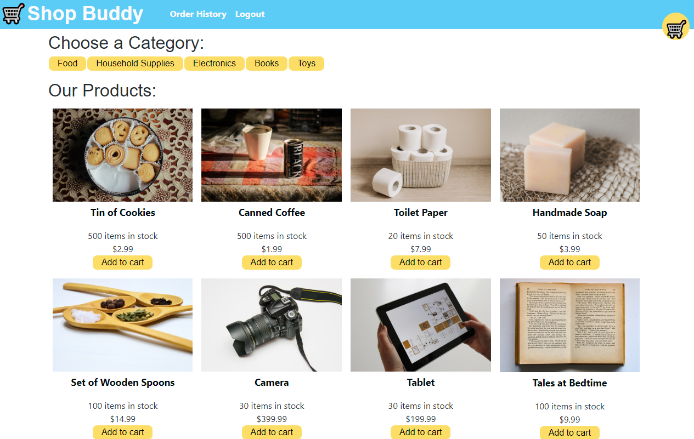

# Shop Buddy

  ## Description
   Shop Buddy is an e-commerce application where you can create an account to login and view multiple categories of items. You also have the capability to add items into a cart to purchase through Stripe.
  
  [Application LINK](https://shop-buddy-mern.herokuapp.com/)
  
  

  ## Table of Contents

  * [Installation](#installation)
  * [Tests](#tests)
  * [Contributing](#contributing)
  * [Usage](#usage)
  * [Questions](#questions)
 

  ## License
  

  ## Installation
  To install the dependencies, run the following command: 

      `npm install`

To run the app in development mode, use the below command:  

     `npm run develop`

  ## Tests
  To run tests, run the following command: 
      "npm test (there are no tests)"

  ## Contributing
  See license info
  
  ## Usage
    See license info
  

  ## Questions
  If you have any questions about the repo, open an issue or contact me directly at <guledlibanosman@gmail.com>.  You can find more of my work on GitHub at [ItzGuled](https://github.com/ItzGuled).
